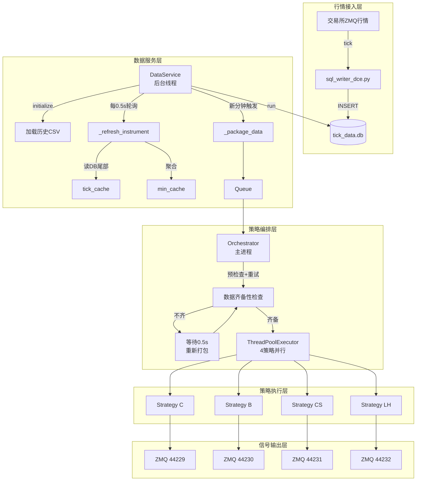
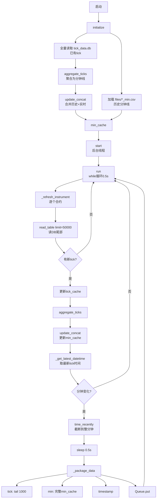
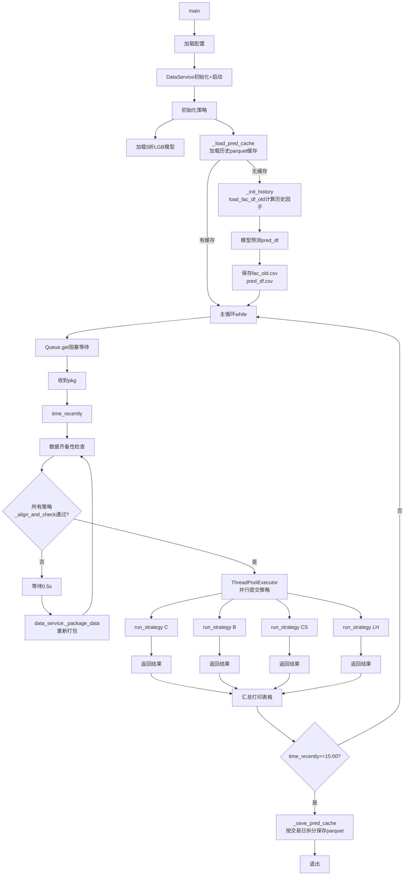
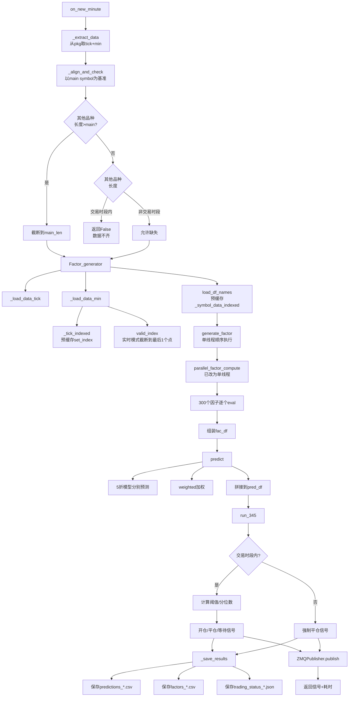

# 实时交易流程图

## 一、架构总览



---

## 二、DataService 内部流程



---

## 三、Orchestrator 主循环



---

## 四、单策略 on_new_minute 内部流程



---

## 五、关键时序与耗时（优化后预估）

| 阶段 | 耗时 | 说明 |
|------|------|------|
| DataService 轮询 | 0.5s | 固定间隔 |
| _package_data | ~0.001s | 内存拷贝 |
| Orchestrator 重试 | 0~1.5s | 仅在不齐时发生 |
| extract | ~0.003s | 字典提取 |
| align | ~0.001s | 长度检查+截断 |
| fac_init | ~0.05s | Factor_generator初始化 |
| **generate** | **~3.0s** | 单线程300因子（优化后） |
| predict | ~0.02s | LGB预测 |
| run345 | ~0.01s | 阈值判断 |
| save | ~0.01s | 写CSV |
| **单策略总耗时** | **~3.1s** | 由generate主导 |
| **4策略并行总耗时** | **~3.1s** | ThreadPoolExecutor并行 |

---

## 六、数据流关键设计

```
┌─────────────┐     tick      ┌─────────────┐     Queue      ┌─────────────┐
│ sql_writer  │ ─────────────→│ DataService │ ─────────────→│ Orchestrator│
│  (写DB)     │               │ (读DB+缓存)  │              │ (调度策略)   │
└─────────────┘               └─────────────┘              └──────┬──────┘
                                                                  │
                              ┌───────────────────────────────────┘
                              │ 每个策略独立线程
                              ▼
                    ┌─────────────────┐
                    │  Strategy X     │
                    │  ├─ tick_data (tail 1000)
                    │  ├─ min_data  (历史+实时)
                    │  ├─ Factor_generator
                    │  ├─ 300因子计算
                    │  ├─ 5折LGB预测
                    │  ├─ 阈值判断(run345)
                    │  └─ ZMQ发布信号
                    └─────────────────┘
```
